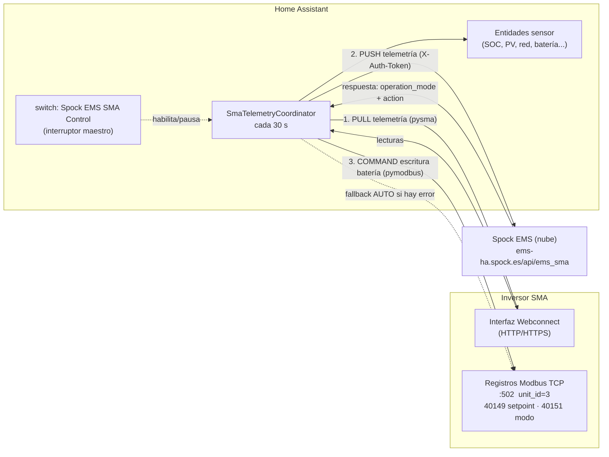

# Spock EMS (SMA)

> Integración personalizada de Home Assistant que conecta tu inversor solar **SMA** con el EMS en la nube de **Spock-p2p**: lee la telemetría local del inversor, la envía a Spock y aplica las órdenes de carga/descarga de batería que Spock devuelve.

[](https://github.com/hacs/integration)
[](custom_components/spock_ems_sma/manifest.json)
[](https://www.home-assistant.io/)
[](https://developers.home-assistant.io/docs/creating_integration_manifest/#iot-class)
[](LICENSE)

---

## Resumen

**Spock EMS (SMA)** (`domain: spock_ems_sma`) es una de las integraciones de marca de la plataforma energética **Spock** para Home Assistant (junto a Growatt, Sonnen y Marstek). Su función es actuar como **puente entre un inversor SMA local y el EMS (Energy Management System) de Spock-p2p** para optimizar el autoconsumo solar y el uso de batería.

A diferencia de una integración de monitorización clásica, ésta es un **lazo de control híbrido**: además de leer la telemetría del inversor y publicarla en Home Assistant, en cada ciclo envía esos datos a Spock y **aplica la consigna de batería** que Spock decide (modo automático, carga forzada o descarga forzada) escribiendo directamente en los registros Modbus del inversor.

- **Hardware objetivo:** inversores SMA con interfaz **Webconnect** habilitada y control de batería por **Modbus TCP** (probado con la familia **Sunny Tripower** / **Sunny Home Manager 2.0**, p. ej. `STPxx-3SE-40`).
- **Conexión local:** lectura vía HTTP Webconnect (librería `pysma`) + escritura de batería vía Modbus TCP (librería `pymodbus`).
- **Conexión nube:** publicación de telemetría y recepción de órdenes contra la API de Spock (`https://ems-ha.spock.es/api/ems_sma`).

---

## Características

- **Lectura de telemetría local** del inversor SMA por Webconnect cada 30 segundos (sin depender de Sunny Portal ni de la nube de SMA para leer).
- **Publicación (PUSH) de telemetría** normalizada a la API de Spock-p2p en cada ciclo.
- **Control de batería por Modbus TCP**: aplica las órdenes `auto` / `charge` / `discharge` que Spock devuelve en la respuesta del PUSH.
- **Las órdenes viajan en la respuesta del PUSH** — no se abre ningún puerto entrante en tu Home Assistant.
- **Fallback de seguridad**: ante cualquier fallo de red, respuesta inesperada o valor inválido, la batería vuelve automáticamente a **modo AUTO (control interno)**; nunca queda atrapada en una consigna externa obsoleta.
- **Interruptor maestro** en Home Assistant para pausar/reanudar todo el lazo (PULL + PUSH + comandos), con el estado **restaurado tras reinicios**.
- **Sensores dinámicos**: sólo se crean las entidades cuyos datos expone realmente tu inversor.
- **Configuración 100% por interfaz** (config flow) con validación de conexión en vivo y **reconfiguración** posterior (options flow).
- **Un único dispositivo** en HA, identificado por el número de serie del inversor (evita duplicados).

---

## Cómo funciona / Arquitectura

El corazón de la integración es un único `DataUpdateCoordinator` (`SmaTelemetryCoordinator`) que se dispara cada **30 s** (`SCAN_INTERVAL_SMA`). Cada ciclo ejecuta tres pasos en orden:

1. **PULL** — lee la telemetría en vivo del inversor SMA vía `pysma` (protocolo Webconnect HTTP).
2. **PUSH** — mapea las lecturas al formato que espera Spock (`_map_sma_to_spock`) y hace `POST` a la API de Spock.
3. **COMMAND** — la **respuesta** de ese POST contiene la orden de batería (`operation_mode` ∈ `auto | charge | discharge` + `action` en vatios), que se aplica al inversor por **Modbus TCP**.

El interruptor maestro cortocircuita el ciclo completo cuando está en OFF (ni PULL, ni PUSH, ni comandos). Cualquier fallo en el paso PUSH/comando dispara el fallback a modo AUTO.



### Control de batería (Modbus)

`SMABatteryWriter` (en [`sma_writer.py`](custom_components/spock_ems_sma/sma_writer.py)) hace las escrituras Modbus crudas. Como `pymodbus` es síncrono, las llamadas se ejecutan en un executor de HA. Dos registros gobiernan todo:

| Registro | Función | Valores |
|----------|---------|---------|
| `40151` | Modo de control | `802` = manual/externo · `803` = auto/interno |
| `40149` | Consigna de potencia (signed 32-bit, W) | **negativo = carga** · **positivo = descarga** |

> Nota sobre el signo: `set_charge_watts(W)` recibe vatios positivos y **niega** el valor antes de escribir el registro 40149 (carga = consigna negativa). El puerto Modbus está fijado a `502`; el `unit_id` es configurable (por defecto `3`).

### Mapeo de telemetría (gotchas)

`_map_sma_to_spock` aplica varias transformaciones no triviales:

- **Importación/exportación de red se suman por fase** (`metering_active_power_draw_l1..l3` y `..._feed_l1..l3`). Los totales trifásicos netos (`metering_power_absorbed/supplied`) se cancelan entre fases y leen ~0, por lo que no se usan para `grid_import`/`grid_export`.
- **`load_power` es derivado**, no medido: `pv_power + grid_import − grid_export − bat_power`.
- **`bat_power` = carga − descarga** (positivo = cargando, negativo = descargando).
- Todos los campos numéricos se envían como **strings de enteros truncados** o `null`.

---

## Requisitos y compatibilidad

| Requisito | Valor |
|-----------|-------|
| Home Assistant | **≥ 2024.6.0** |
| Clase IoT | `local_polling` |
| Dependencias HA | `http` |
| Dependencias Python | `pysma==1.1.1`, `pymodbus>=3.0.0,<4.0.0` (instaladas automáticamente por HA) |
| Inversor | SMA con **Webconnect** habilitado + **Modbus TCP** accesible en el puerto `502` |
| Modelos verificados | Sunny Tripower / Sunny Home Manager 2.0 (familia `STPxx-3SE-40`) |

También necesitas una cuenta en la plataforma **Spock-p2p** que te facilite un **Plant ID** y un **API Token**.

> El inversor SMA debe ser accesible en la red local de Home Assistant tanto por HTTP/HTTPS (Webconnect) como por Modbus TCP. La verificación del certificado SSL está **desactivada por defecto** (hardcoded) para tolerar los certificados autofirmados de SMA.

---

## Instalación

### Opción 1 — HACS (recomendada)

1. Abre **HACS** en Home Assistant.
2. Ve a **Integraciones**, menú de tres puntos (arriba a la derecha) → **Repositorios personalizados**.
3. Añade la URL del repositorio y selecciona la categoría **Integración**:

   ```text
   https://github.com/Spock-p2p/ha-spock_ems_sma
   ```

4. Busca **"Spock EMS (SMA)"** en HACS y pulsa **Instalar**.
5. **Reinicia Home Assistant**.

### Opción 2 — Instalación manual

1. Copia la carpeta `custom_components/spock_ems_sma` de este repositorio dentro del directorio `custom_components` de tu configuración de HA:

   ```text
   <config>/custom_components/spock_ems_sma/
   ```

2. **Reinicia Home Assistant**.

---

## Configuración

Toda la configuración se hace por la interfaz (no hay YAML).

1. **Ajustes → Dispositivos y Servicios → Añadir Integración**.
2. Busca **"Spock EMS (SMA)"**.
3. Rellena el formulario y pulsa **Enviar**. La integración validará la conexión con el inversor (`pysma.new_session()` + `device_info()`) antes de crear la entrada; el número de serie del inversor se usa como identificador único.

### Campos del formulario inicial

| Campo | Clave | Tipo | Por defecto | Descripción |
|-------|-------|------|-------------|-------------|
| ID de Planta (Spock) | `plant_id` | string | — (requerido) | ID de planta proporcionado por Spock-p2p. |
| Token de la API de Spock | `spock_api_token` | string | — (requerido) | Token secreto enviado como cabecera `X-Auth-Token`. |
| Host (IP o DNS) del dispositivo SMA | `host` | string | — (requerido) | IP/host local del inversor SMA (p. ej. `192.168.1.50`). Se usa tanto para Webconnect como para Modbus. |
| Grupo de Usuario | `group` | `user` \| `installer` | `installer` | Grupo de inicio de sesión de Webconnect. Se recomienda `installer` para acceso completo. |
| Contraseña | `password` | string | — (requerido) | Contraseña del grupo de usuario de Webconnect. |
| Usar SSL (HTTPS) | `ssl` | bool | `true` | Usa HTTPS contra Webconnect. La verificación del certificado va siempre desactivada (certificados autofirmados de SMA). |
| Modbus Unit ID | `modbus_unit_id` | int | `3` | Unit ID Modbus del inversor para el control de batería. El puerto está fijado a `502`. |

### Reconfiguración (options flow)

Desde la tarjeta de la integración puedes pulsar **Configurar** para reabrir el mismo formulario y editar cualquiera de los valores anteriores. El flujo de opciones **revalida la conexión**, reescribe la configuración y **recarga la integración** automáticamente.

---

## Entidades

Todas las entidades se agrupan bajo un único **dispositivo** identificado por el número de serie del inversor. Los sensores se crean **dinámicamente**: sólo aparecen los que tu inversor expone realmente en el primer refresco.

### Interruptor (`switch`)

| Entidad | Tipo | Descripción |
|---------|------|-------------|
| `Spock EMS SMA Control` | `switch` | Interruptor maestro. **ON**: el lazo PULL/PUSH/comando funciona con normalidad. **OFF**: pausa el ciclo entero (no lee, no envía, no aplica órdenes). El estado se restaura tras reiniciar HA. |

### Sensores (`sensor`)

Cada entrada existe sólo si la clave `pysma` correspondiente está presente en los datos del inversor.

<details>
<summary><b>Ver tabla de sensores (11)</b></summary>

| Entidad (nombre) | Clave pysma | Unidad | Device class | Descripción |
|------------------|-------------|--------|--------------|-------------|
| SMA Batería SOC | `battery_soc_total` | `%` | battery | Estado de carga de la batería. |
| SMA Batería Potencia Carga | `battery_power_charge_total` | `W` | power | Potencia instantánea de carga de la batería. |
| SMA Batería Potencia Descarga | `battery_power_discharge_total` | `W` | power | Potencia instantánea de descarga de la batería. |
| SMA Batería Temperatura | `battery_temp_a` | `°C` | temperature | Temperatura de la batería. |
| SMA PV Potencia A | `pv_power_a` | `W` | power | Potencia del string fotovoltaico A. |
| SMA PV Potencia B | `pv_power_b` | `W` | power | Potencia del string fotovoltaico B. |
| SMA Red Importación L1 | `metering_active_power_draw_l1` | `W` | power | Potencia importada de red, fase L1. |
| SMA Red Importación L2 | `metering_active_power_draw_l2` | `W` | power | Potencia importada de red, fase L2. |
| SMA Red Importación L3 | `metering_active_power_draw_l3` | `W` | power | Potencia importada de red, fase L3. |
| SMA Red Exportación L1 | `metering_active_power_feed_l1` | `W` | power | Potencia inyectada a red, fase L1. |
| SMA Red Exportación L2 | `metering_active_power_feed_l2` | `W` | power | Potencia inyectada a red, fase L2. |
| SMA Red Exportación L3 | `metering_active_power_feed_l3` | `W` | power | Potencia inyectada a red, fase L3. |
| SMA Estado | `status` | — | — | Estado operativo del inversor (texto, p. ej. `Ok`). |

</details>

> Todos los sensores numéricos usan `state_class: measurement`. El sensor `SMA Estado` expone texto.

---

## Servicios

Esta integración **no expone servicios propios** (`services.yaml`). El control de la batería no se hace por servicios de HA, sino que lo decide el EMS de Spock y se aplica automáticamente vía Modbus en cada ciclo. La única acción manual desde HA es encender/apagar el **interruptor maestro**.

---

## Ejemplos de uso

### Pausar la operativa de Spock por la noche

Apaga el interruptor maestro fuera de horario solar para detener el lazo (la batería quedará en su último estado; usa el modo AUTO de Spock o tu programación interna del inversor según convenga).

```yaml
automation:
  - alias: "Pausar Spock EMS SMA por la noche"
    trigger:
      - platform: time
        at: "23:30:00"
    action:
      - service: switch.turn_off
        target:
          entity_id: switch.spock_ems_sma_control

  - alias: "Reanudar Spock EMS SMA al amanecer"
    trigger:
      - platform: sun
        event: sunrise
    action:
      - service: switch.turn_on
        target:
          entity_id: switch.spock_ems_sma_control
```

### Panel de Energía

Los sensores de potencia (`device_class: power`, `state_class: measurement`) pueden integrarse en tarjetas y gráficas. Si quieres usarlos en el **Panel de Energía** de Home Assistant, crea sensores de energía (`Riemann sum integral`) a partir de los sensores de potencia de PV, red y batería que necesites.

---

## Solución de problemas (FAQ)

- **No se puede conectar (`cannot_connect`)**: comprueba que la IP/host del inversor es accesible desde HA y que Webconnect está habilitado. Verifica también el puerto Modbus `502` si el control de batería falla.
- **Autenticación inválida (`invalid_auth`)**: revisa grupo de usuario (`user`/`installer`) y contraseña de Webconnect.
- **No aparecen sensores**: los sensores se crean sólo si su clave existe en los datos del inversor; modelos sin contador trifásico, sin batería o sin segundo string FV no mostrarán esas entidades.
- **La batería vuelve sola a modo AUTO**: es el comportamiento de seguridad esperado ante un fallo de red, una respuesta inesperada de Spock o una orden inválida. Revisa los logs del PUSH a Spock.
- **El error/datos no cambian estando el switch en OFF**: con el interruptor maestro apagado el ciclo está pausado por completo; enciéndelo para reanudar.

### Activar logs de depuración

Añade esto a `configuration.yaml`, reinicia HA y revisa **Ajustes → Sistema → Registros**:

```yaml
logger:
  default: warning
  logs:
    custom_components.spock_ems_sma: debug
    pysma: debug
    pymodbus: debug
```

---

## Estructura del proyecto

```text
custom_components/spock_ems_sma/
├── __init__.py          # Setup/teardown de la entrada: crea sesiones (pysma + HA), instancia el coordinador y carga plataformas
├── config_flow.py       # Config flow + options flow: formulario, validación en vivo con pysma, serial = unique_id
├── const.py             # Dominio, intervalo (30 s), endpoint Spock, claves de configuración, plataformas
├── coordinator.py       # SmaTelemetryCoordinator: lazo PULL→PUSH→COMMAND, mapeo de telemetría y fallback AUTO
├── sma_writer.py        # SMABatteryWriter: escrituras Modbus TCP (registros 40149/40151) auto/carga/descarga
├── sensor.py            # Plataforma sensor: SENSOR_MAP + creación dinámica de entidades
├── switch.py            # Plataforma switch: interruptor maestro con estado restaurado
├── manifest.json        # Metadatos de la integración (versión, requirements, iot_class, etc.)
└── translations/
    ├── en.json          # Traducciones del config flow (inglés)
    └── es.json          # Traducciones del config flow (español)
```

---

## Créditos y licencia

- **Autor / mantenedor:** [@Spock-p2p](https://github.com/Spock-p2p) (codeowner).
- Construido sobre [`pysma`](https://pypi.org/project/pysma/) (Webconnect) y [`pymodbus`](https://pypi.org/project/pymodbus/) (Modbus TCP).
- Parte de la plataforma energética **Spock** / EMS (Energy Management System), junto a las integraciones hermanas para Growatt, Sonnen y Marstek.

Distribuido bajo licencia **Apache 2.0**. Consulta [`LICENSE`](LICENSE).
